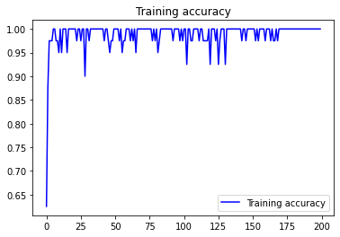
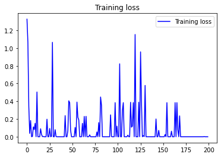
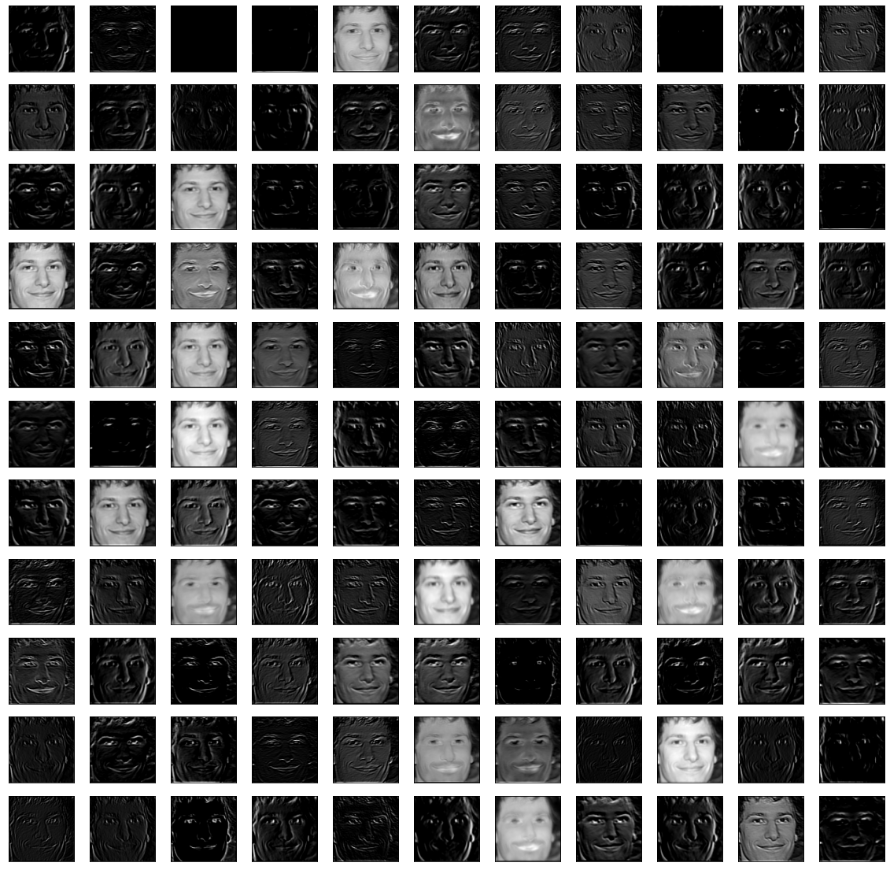
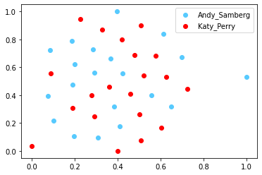
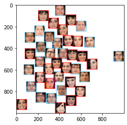

# Celebrity Face Classification

 The .ipynb notebook [CelebrityFaceClassification_Transfer_Learning.ipynb](CelebrityFaceClassification_Transfer_Learning.ipynb) can be run directly on Google Colab that downloads the required dataset and performs Classification after extracting the facial information from images using harr cascade xml. 

## Classification:
This project is done as a sub part of the second project of the course Computer Vision at KU Leuven.
A VGG16 Model is trained on the facial dataset of Hollwywood celebrities available at http://www.robots.ox.ac.uk/~vgg/data/vgg_face/vgg_face_dataset.tar.gz

The VGG Model is then trained on some classes of selected celebrities and their look alikes using transfer learning. The pre-trained weights (VGG FACE) are loaded directly from the keras library.

The learning curves for the model are as given below

 

After Classification, we visualize the feature maps of one of the layer. The layer for which the feature map is to be visualized can be configured in the code. One  such  feature map is as follows

 ## t-SNE (t-Distributed Stochastic Neighbor Embedding) :

We then visualize the obtained feature maps using the inbuilt function TSNE available in the scikit learn package.

Internally, t-SNE uses an iterative approach with a default iterations steps 1000, making small (or sometimes large) adjustments to the points. In practice, it often terminates early if it  finds a locally optimal (good enough) embedding.

* n_components is the number of dimensions to project down to. In principle it can be anything, but in practice t-SNE is almost always used to project to 2 or 3 dimensions for visualization purposes. For our case, we use n_components as 2

* learning_rate is the step size for iterations.

* perplexity refers to the number of independent clusters or zones t-SNE will attempt to fit points around. It is relatively robust to large changes, and usually a value between 20-50 works best.

* angle controls the speed vs accuracy tradeoff. Lower angle means better accuracy but slower, although in practice, there is usually little improvement below a certain threshold.

The t-SNE plots are as given below:

 
